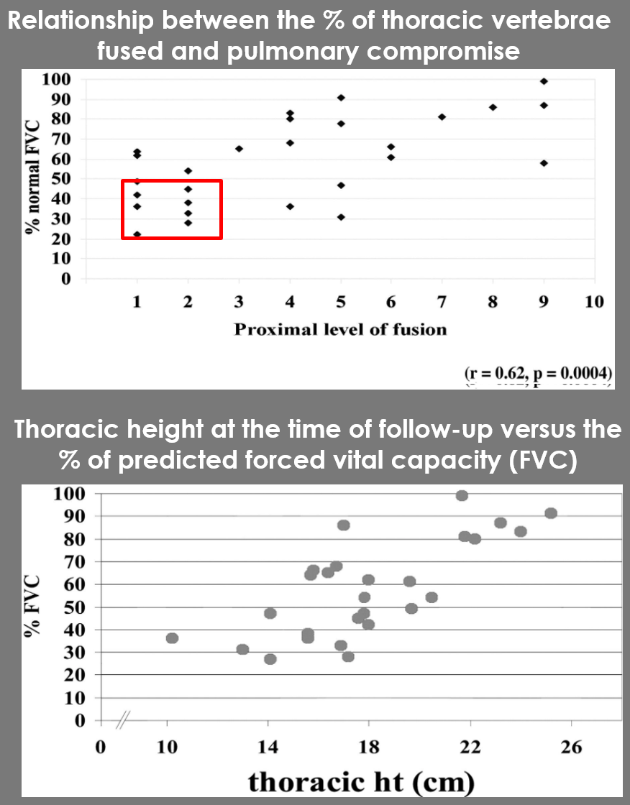
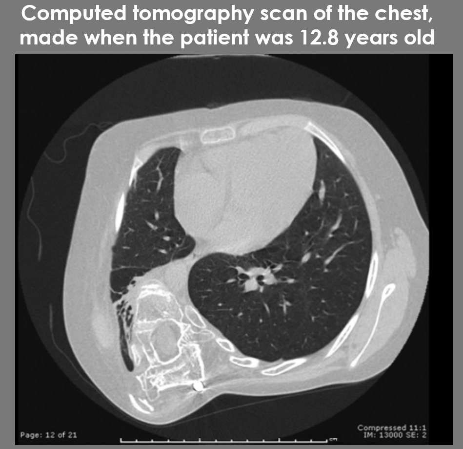

Final project for Anatomy & Physiology 338 Human Anatomy Laboratory

Project Objectives: 
Our review hypothesizes that scoliosis affects the pulmonary function in children. Early spinal fusion from scoliosis also affects lung growth in young children. 

In patients with scoliosis, forced expiratory volume in one second was only 27 % of normal values. It also diminished maximum inspiratory pressure, caused chest weakness and hypercarbia

	Patients with fusions included T1 and T2 had the greatest pulmonary compromise with Force vital capacity (FVC) <50%                               r = 0.62, p < 0.0004).

	Patients with the shortest thoracic spinal height (measured from T1 to T12) had the greatest restriction of pulmonary volume                                 r = 0.73, p < 0.001)

In patients with scoliosis:

•	forced expiratory volume in one second was only 27 % of normal values

•	It also diminished maximum inspiratory pressure

•	Caused chest weakness and hypercarbia

Figures source: 

Karol, L. A., Johnston, C., Mladenov, K., Schochet, P., Walters, P., & Browne, R. H. (2008). Pulmonary function following early thoracic fusion in non-neuromuscular scoliosis. Journal of Bone and Joint Surgery, 90(6). https://doi.org/10.2106/JBJS.G.00184

