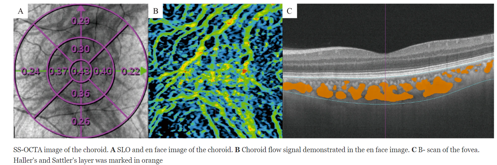
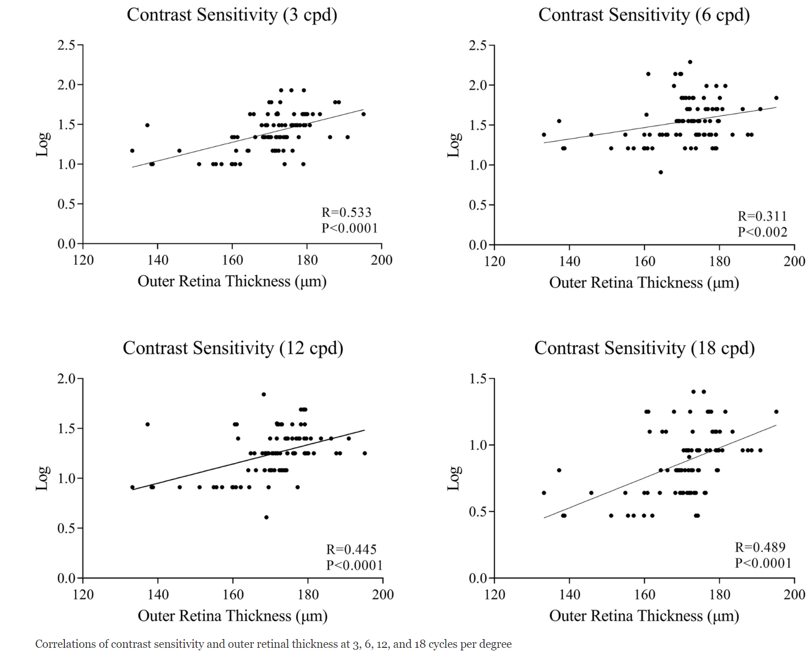

Microscopy of Life, Biomedical Engineering 619, Final Project

This research project is a review of optical coherence tomography (OCT) as a non-invasive optical interferometric method for Parkinson’s disease diagnosis.
I am working on this review paper under the guidance of [Prof. Eliceiri](https://directory.engr.wisc.edu/bme/faculty/eliceiri_kevin) in Laboratory for Optical and Computational Instrumentation lab [LOCI](https://eliceirilab.org/). I hope to submit my review paper for this research project in Spring 2023.
 
Neurodegenerative movement disorders include Parkinson's disease (PD). Neurodegenerative processes, which affect the brain of PD patients, may also have negative effects on the retina. An optical coherence tomography image can be obtained in a non-invasive, quick, and cost-effective manner using optical interferometry.
Using this review, we will assess if retinal nerve fiber layer thickness (RNFLT) and retinal thickness (RT) differ between patients with PD and healthy individuals. The majority of reports indicate that RNFLT tends to be thinner in patients with Parkinson's disease, despite different studies providing conflicting results.
Figures above depict choroid and capillary changes in early-stage Parkinson’s disease.

According to our review, PD patients had lower RNFLTg, nasal retinal segment (RTn), visual acuity (VA), and intraocular pressure (IOP) scores. It is possible that lower VA scores were caused by the thinning of the RNFLTg and RTn. Thus, future studies should evaluate the reason for lower IOP values in non-glaucomatous IPD patients, and more comprehensive studies should be performed on a larger population.

Figures source:

Zhang, Y., Yang, L., Gao, Y. et al. Choroid and choriocapillaris changes in early-stage Parkinson’s disease: a swept-source optical coherence tomography angiography-based cross-sectional study. Alz Res Therapy 14, 116 (2022). https://doi.org/10.1186/s13195-022-01054-z
