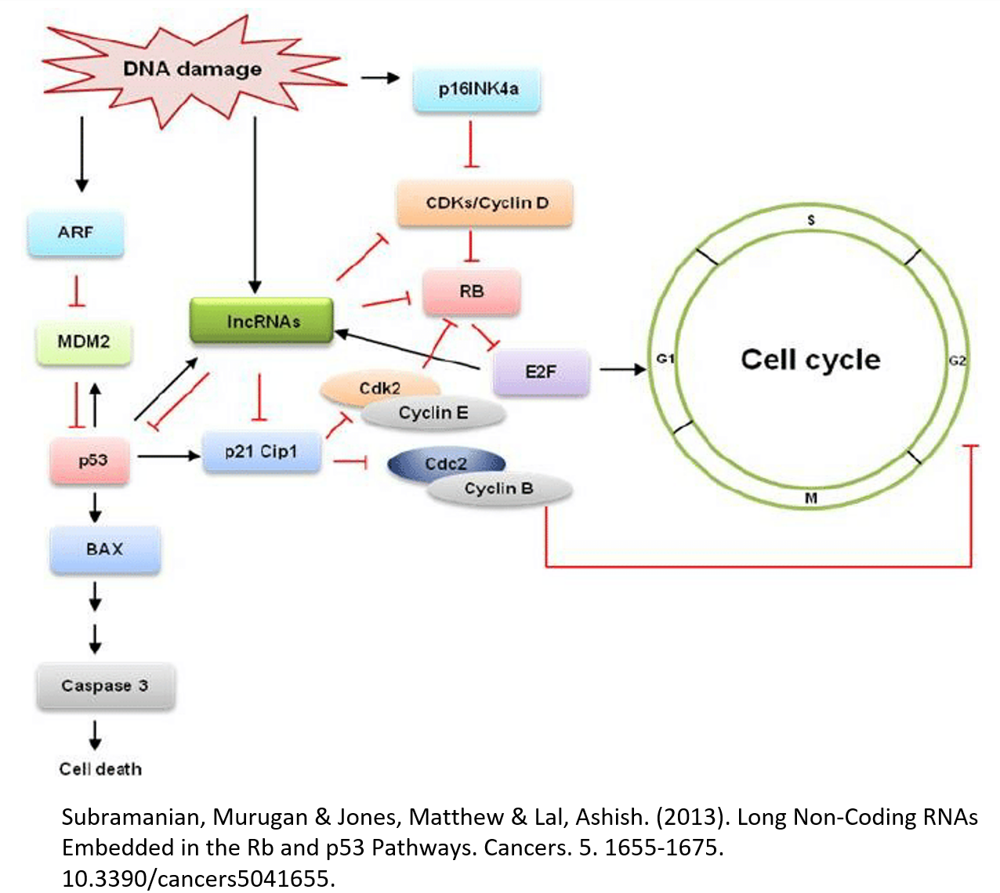
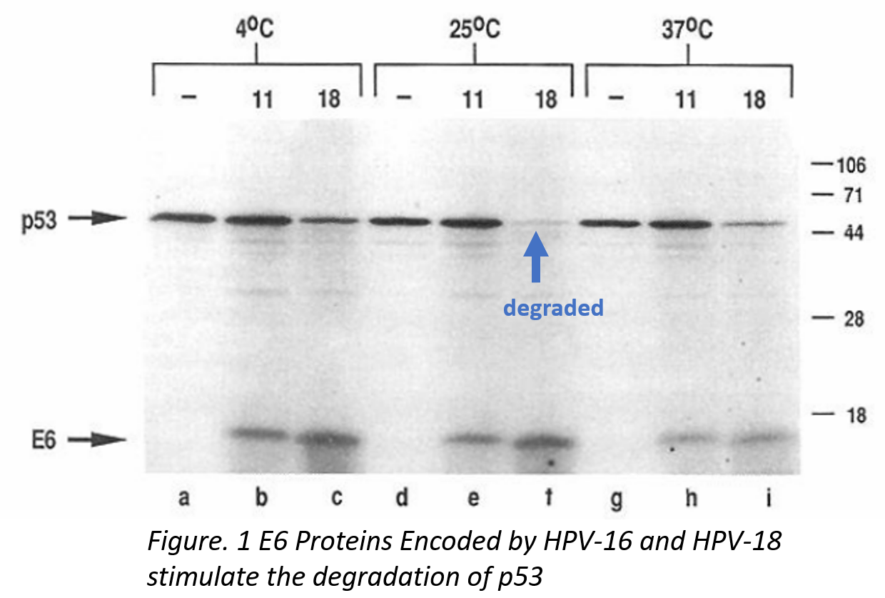
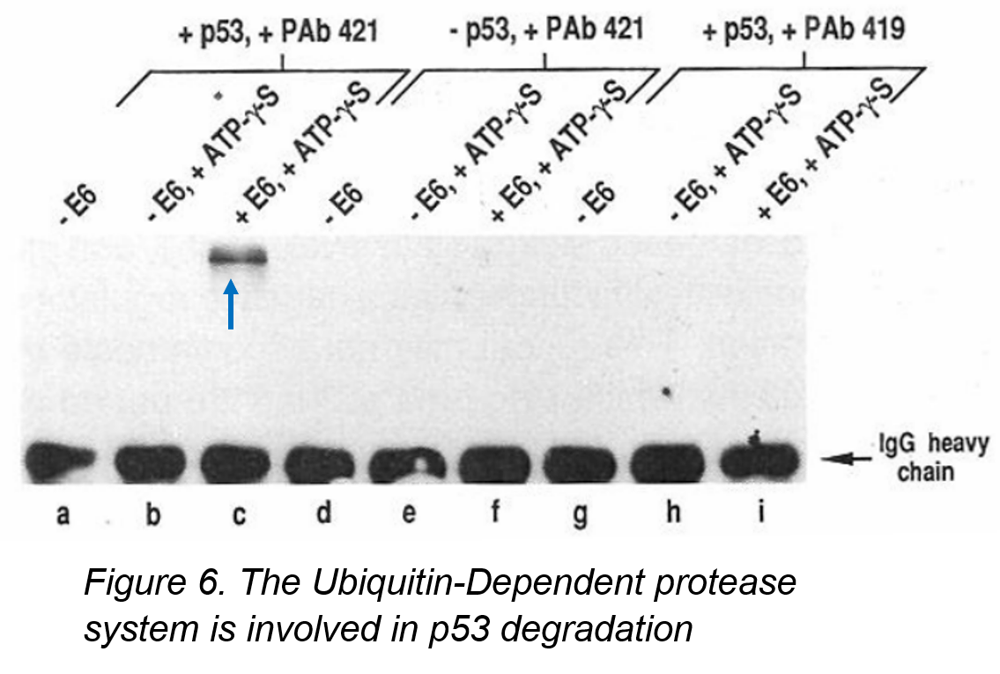

Final project for Cancer Genetics 662

HPV-11 and HPV-6 are low-risk Human Papillomavirus (HPV) and cause benign anogenital warts that usually do not become cancerous. They have been shown to bind to pRB. 
HPV-16 and HPV-18 are high-risk HPVs. They cause lesions that often result in cervical carcinomas and have been shown to bind to pRB. HPV-16 E6 can bind to p53 but HPV-16 E7 cannot bind to p53. Only E6 proteins of HPV-16 and HPV-18 were binding to human p53 protein. E6 of HPV-16 twice as likely to bind as E6 of HPV-18. 

In cells infected with HPV-16 and HPV-18 , there is no detectable amount of p53 protein. E6 protein may degrade wild-type p53, destroying its functionality as a tumor suppressor. 

The E6 Oncoprotein Encoded by Human Papillomavirus Type 16 and 18 Promotes the Degradation of p53. Presence of HPV-18 E6 leads to in vitro degradation of p53. Once p53 molecules were targeted, degradation occurred rapidly and completely.

•	Wild-type p53 gene have tumor suppressor properties while the mutated p53 augments transformation. 

•	The consequence of this interaction between p53 and high-risk HPV oncoprotein would be equivalent to binding and inactivating an intracellular negative growth regulator, which can lead to unrestricted cellular proliferation. 

•	The mutated p53 gene has been found to be in a high percentage of human colon carcinomas and in human lung cancers. 

•	The elimination of wild-type p53 would be predicted to provide a growth advantage to those cells expressing E6.

Figures source: 

Werness, B., et al. “Association of Human Papillomavirus Types 16 and 18 E6 Proteins with p53.” Science, vol. 248, no. 4951, 1990, pp. 76–79., doi:10.1126/science.2157286.

