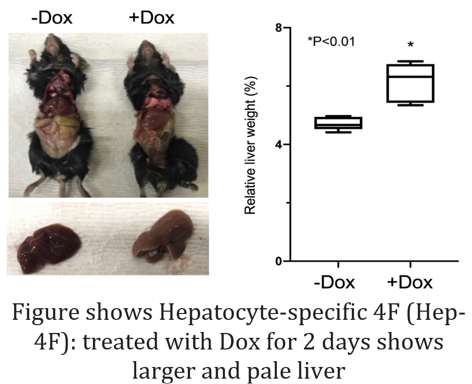
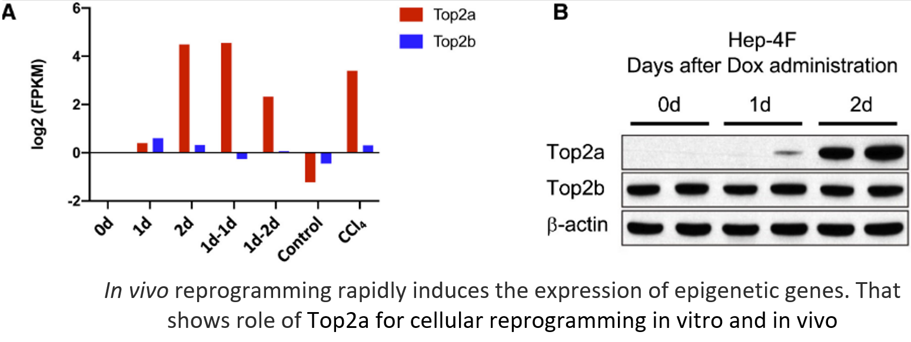

Final Project for Genetics 527 Developmental Genetics for Conservation & Regeneration 

The organ regeneration capacity of some vertebrates, like fish and salamanders, depends on cell differentiation followed by proliferation. The goal of this review is to assess the effect of inducible expression of the four Yamanaka factors 4F specifically in hepatocytes. 4F in vivo expression transiently induced partial reprogramming of adult hepatocytes to a progenitor state and increased cell proliferation. 

This effect was indicated by an increase in markers of proliferation, global changes in DNA accessibility and reduced expression of differentiated hepatic-lineage markers. These results show that using partial reprogramming, cellular plasticity can be induced, and liver failure can be counteracted suggesting an avenue for enhancing tissue regeneration.  

Figure source: 

Hishida, Tomoaki, Mako Yamamoto, Yuriko Hishida-Nozaki, Changwei Shao, Ling Huang, Chao Wang, Kensaku Shojima et al. "In vivo partial cellular reprogramming enhances liver plasticity and regeneration.", no. 4 (2022): 110730.

Miller, E. L., Hargreaves, D. C., Kadoch, C., Chang, C. Y., Calarco, J. P., Hodges, C., Buenrostro, J. D., Cui, K., Greenleaf, W. J., Zhao, K., & Crabtree, G. R. (2017). TOP2 synergizes with BAF chromatin remodeling for both resolution and formation of facultative heterochromatin. Nature Structural and Molecular Biology, 24(4). https://doi.org/10.1038/nsmb.3384

