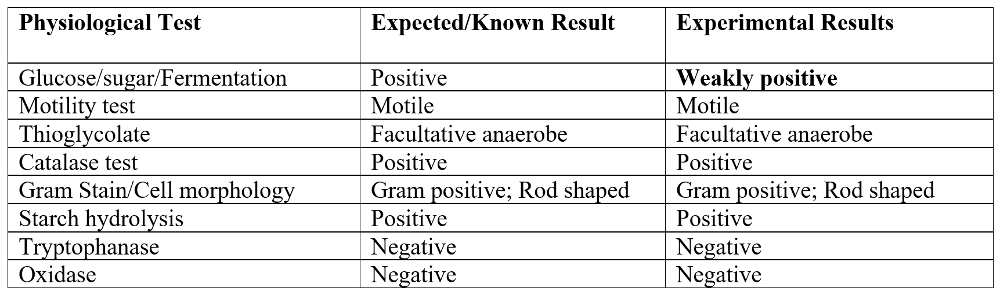
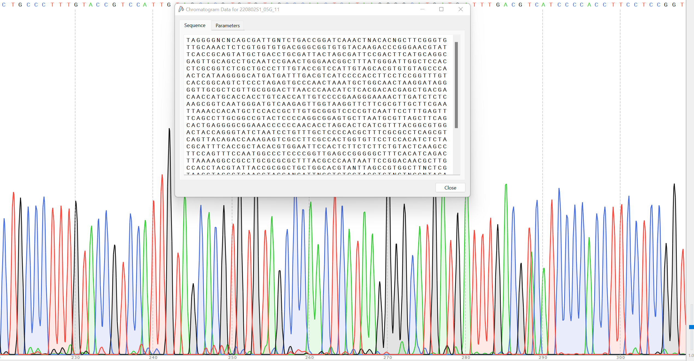

Final Project for Microbio 304 Lab:

In this project, a bacterium is isolated from an organic lettuce sample and grown in YTG media. Physiological tests such as cellular morphology, glucose/lactose fermentation, motility catalase, oxidase test, tryptophanase test, etc. were used for bacterium identification. Then chromosomal DNA is isolated from the pure culture of our natural isolate, and PCR is used to amplify the 16S rRNA gene. The region is then sequenced and compared to all other known sequences to identify the strain. Based on physiological and molecular characterization, this research hypothesized that the bacterial strain in our natural isolate from the organic lettuce sample is Exiguobacterium undae. 

Fermentation broth indicated a weakly positive result for fermentation of glucose or lactose. In motility media, nature isolate gave a positive test and was motile. Microbial strain is a facultative anaerobe and catalase positive. Nature isolate is rod-shaped and gram-positive. It is positive for starch hydrolysis and negative for enzyme tryptophanase and oxidase. 

Agarose gel analysis for DNA electrophoresis showed that the correct single band of 1465 bp is amplified. Exiguobacterium undae is a motile, facultative anaerobe, gram-positive, rod-shaped bacteria based on physiological test. It is oxidase negative and tryptophanase negative, weakly positive for glucose/sugar fermentation, positive for catalase and starch hydrolysis. In addition, 16s rRNA gene DNA sequence using BLAST also identified our nature isolate as Exiguobacterium undae. 
