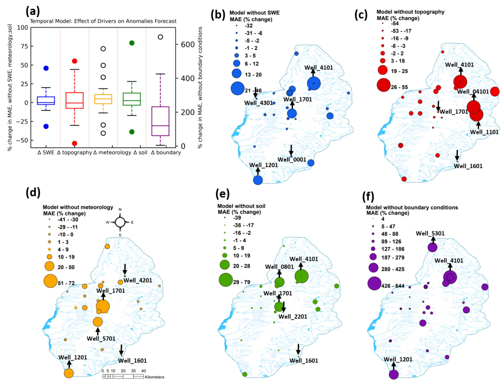

Wisconsin is humid, though GW shortages have been reported in several regions, including the Wisconsin Central Sands (WCS). The shortage of GW in the WCS is caused by many factors, including climate variability, fast expansion of irrigation, increasing high-capacity wells, and increasing population. For sustainable 
water resource management, there is an urgent need to develop a computationally-efficient and easy-to-update  framework with the capability of efficient incorporation of recently developed and regularly updated environmental datasets (e.g., remote sensing maps of evapotranspiration and soil 
moisture).
 
The research questions for this project include: Using computationally efficient ML models, can easy-to-obtain remote sensing derived environmental datasets be combined to accurately predict GW dynamics across the WCS? How does GW anomaly vary in space and across the WCS? How pumping and crop type change can influence this anomaly forecasting?

Static and dynamic variables were used to build LSTM model for 
prediction of GW depth at the 26 well locations in the WCS region monthly from 1958 to 2020.

The effect of topography-related drivers is more conspicuous than SWE drivers. For example, for four wells, MAE was reduced by greater than 10 %, but for eight wells, MAE increased by greater than 10 %. 
Additionally, these three wells with the highest % change in MAE were located on the northeast side of WCS. All drivers, except meteorology-associated drivers, increased MAE for well_4101 when excluded. Well_1701 MAE was also increased when other drivers were excluded except for topography-related drivers. Based on permutation feature importance, PDSI, SW radiation, soil moisture, wind speed, and runoff were among the most important features.

Pumping or irrigation demand has a higher relative importance to GW anomalies forecast compared to land use change. 
There is a direct connection between pumping and groundwater level change based on simple physics, but initially, it wasn't clear whether irrigation demand would have a more substantial impact on groundwater anomalies than land use change since land use changes determine irrigation demand because of their correlation. Groundwater dynamics are closely related to agricultural irrigation in the WCS. 

In our observations, negative anomaly means shallow GW, so pumping has greater influence on shallow GW. Hence model can better estimate anomaly for shallower water. Pumping makes GW deeper so the anomaly becomes positive. 
I hope to submit my manuscript for this research project by January 2022.

A [research paper](https://doi.org/10.1016/j.agrformet.2024.109967) detailing the findings of this research has been accepted in the Journal of Hydrology. 

