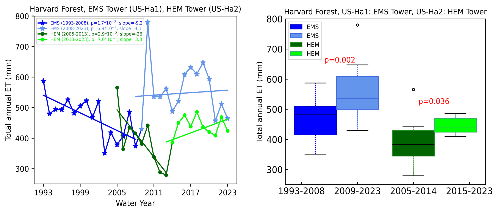

Over the past few decades, HWA infestation has significantly affected eastern hemlock (Tsuga canadensis) in the eastern U.S., and winters are expected to continue to warm in the future. Direct ET measurements are particularly essential for managing forests as pressures on high-quality surface water supply increase. 
Our study investigates how forest disturbances, climate change, and ET interact to influence the water cycle in the eastern U.S., where surface water regeneration plays a critical role in local water supply systems. 
 
We hypothesized that the biotic stress and mortality by HWA at the eastern hemlock site would cause an initial decrease in ET followed by an increase as deciduous species replaced hemlock. We also expected to find larger shifts in ET in the non-growing season due to the stress and mortality of the evergreen hemlock trees, 
coupled with increasingly warmer winter conditions that allow higher year-round transpiration. At both sites, we hypothesized that the meteorological drivers associated with PET would increase year-round due to higher temperatures and vapor pressure deficit with climate change.

Figure demonstrates that both EMS and HEM tower shows a decline in ET in the initial time period. For example, ET has declined significantly (p=1.7^10-2) from 587.2 to 374.2 during 2003-2008 with a negative slope of -9.2 and percent change of 31.5%. HEM tower also showed a significant decline (p=2.9^10-1) in ET from 565.7 to 278.9 mm with a steep slope of -26 and percent change of 60.6%. 
After an initial decline in ET at both sites, an increase in ET was observed for the later period of time series. For example, at EMS site, ET was slightly increased (p=6.9*10-1) from 374.2 to 464.5 mm with a slope of 4.1 and percent change of 12%. Similarly HEM site ET also increased from 278.9-424 with a slope of 3.3 and a change of 12%. 

The figure shows a significant decrease at a rate of -0.004 mol m-2 s-1 year-1 (38.6%) over this time period (Kendall τ = -0.34, p = 0.007). Time series trends for growing season gs paralleled those of the annual gs with a significant decrease at a rate of -0.006 mol m-2 per year (Kendall τ = -0.40, p = 0.002). At the EMS site the non-growing season gs did not have a significant trend through time. 
A t-test found that the mean annual gs of 0.32 mol m-2 s-1 with a range of 0.22–0.42 mol m-2 s-1 (SD=0.05) for 2005-2023 was significantly lower than that of EMS (t-test, p = 2.24^10-16).

At the EMS site, NETRAD was identified as the most influential meteorological factor affecting ET, followed by month, GPP, VPD, and PAR. In contrast, at the HEM site, GPP was the most significant factor influencing ET, followed by NETRAD, NEE, VPD, and Tair. 
The correlation between GPP and ET is stronger at the HEM site compared to the EMS site. Conversely, the importance of NETRAD is greater at the EMS site than at the HEM site.

A [presentation](https://agu.confex.com/agu/hydrology24/meetingapp.cgi/Person/1494288) detailing the findings of this research was delivered in Water Science Conference (WaterSciCon24).
