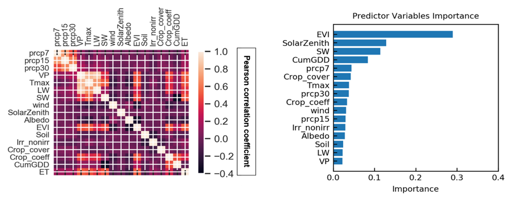
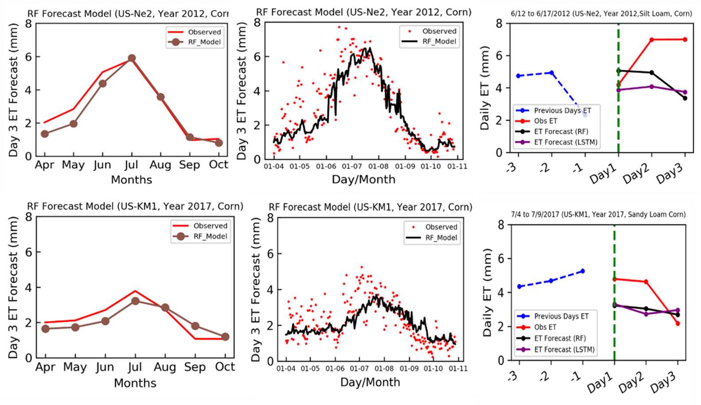

The potentials of random forest (RF) and long short-term memory (LSTM) neural networks to estimate and forecast daily ET for corn, soybeans, and potatoes in diverse agricultural farms was evaluated in this research. The proposed modeling architecture provides a field-scale, locally calibrated tool for accurate prediction and short-term forecasting of daily ET in areas lacking in situ ET, metrological, and biophysical data. Furthermore, since there is no clear understanding of minimum required predictors for accurate estimates of ET, our models with different sets of predictors can help to understand the need for essential or minimum drivers for different crop fields on various soil textures in areas with scarce data. 

The goals of this research include, how well can empirical ML models predict and forecast ET 3 days in advance in irrigated and rain-fed agricultural lands across the Midwest US? And What are important drivers for predicting and forecasting ET 3 days in advance in irrigated and non-irrigated areas?

Prediction and forecasting models for ET based on RF and LSTM framework with 5, 11, and 16 predictors was proposed. For all model experiments, simulations were based on daily time step from 2003-2019. The selection of sixteen model input predictors for RF_16 and LSTM_16 model was due to their influence on ET and their availability for agricultural sites. After calibration and validation, empirical models of RF and LSTM were benchmarked against output from process-based model ET from the North American Land Data Assimilation System (NLDAS) version 2 LSM model. 

The performance of the two ET prediction algorithms for the test data, which demonstrated the ability of the calibrated models to generalize to unseen ET observations (test data) from eddy covariance flux towers across multiple crop types. The evaluation statistics indicated that there is a good agreement between the predicted and observed ET values across corn, soybeans, and potatoes. 

 

Our analysis for RF model showed that VP and crop coefficients were the most important predictors for irrigated crops, while short wave radiation and enhanced vegetation index were key predictors for non-irrigated crops.

 

A multistep forecast model that can forecast ET three days ahead of time using RF and LSTM models was developed. Finally, the importance of model predictors was calculated for both prediction and forecast model versions of RF. 

A [research paper](https://doi.org/10.1016/j.jhydrol.2021.126579) detailing the findings of this research has been accepted in the Journal of Hydrology. 
