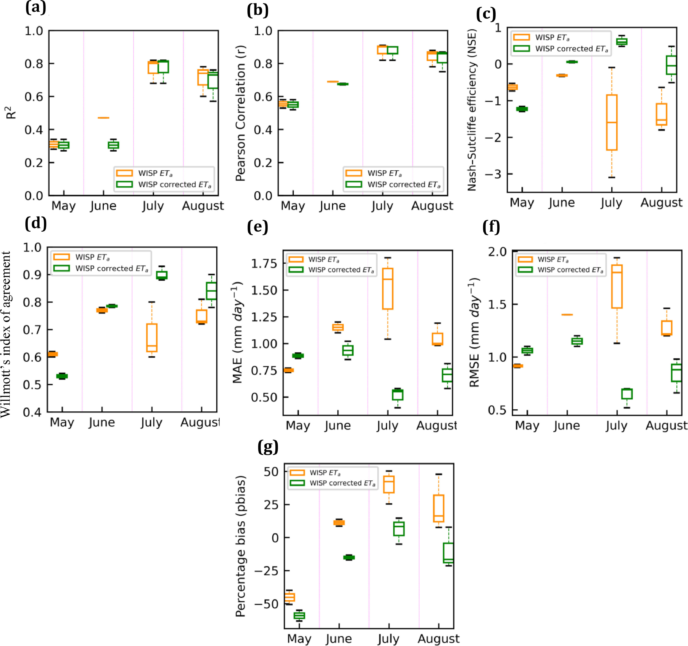

The first chapter of my thesis seeks to improve the parameterization of atmospheric emissivity of a regional irrigation scheduling program for evapotranspiration estimation using eddy covariance measurements. The performance of land surface model-based AET, reanalysis, and remote sensing products varies at different spatio-temporal scales. In the Central Sands Regions of Wisconsin, irrigation agriculture plays a fundamental role in supporting regional agricultural production and rural community development. For irrigation scheduling, farmers often rely on the Wisconsin Irrigation and Scheduling Program (WISP) model, developed by soil scientists at UW-Madison and based on satellite data. WISP is a regional model based on the Priestley Taylor approach and provides Potential ET (PET) estimates that can be scaled to ET based on percent canopy cover. 

In 2018, with support from the [Wisconsin Potato and Vegetable Growers Association]( https://wisconsinpotatoes.com/) Water Task Force, [the Wisconsin Department of Natural Resources]( https://dnr.wisconsin.gov/topic/Groundwater/GCC/research.htm), and the UW [Center for Climatic Research]( https://ccr.nelson.wisc.edu/), our lab installed eddy covariance flux towers on a center-pivot irrigated potato field (US-CS1) from June 2018-May 2019, the [Tri-County School Forest](https://www.tricounty.k12.wi.us/district/schoolforest.cfm) pine stand Sept 2018-, a 2nd potato field (US-CS3) from June 2019-June 2020, and a 3rd potato field (US-CS4) from June 2020-present. Links to graphs, tables, and publications are at project website [Water use in Wisconsin Potatoes and Pine] (https://flux.aos.wisc.edu/potato)

This research evaluates sources of bias in the WISP model and develops a correction using eddy covariance (EC) observations. AET observations were made for five years (2018–2022), using EC systems in irrigated potatoes fields in Wisconsin Central Sands (WCS) region. Multi-source ET datasets should be employed in future studies to enhance confidence in remotely sensed ET related water budgets.

The source of uncertainty in the model could be due to model inputs of coefficients used in empirical equations. Those coefficients are not regionally calibrated, which could lead to underestimating the energy budget.
Wisconsin is humid, where ET is energy limited, and by correcting the energy budget, we expect to see reduced bias in model ET. 

The WISP model 
overestimated ET before correction because modeled AET range for the WCS region was 7.17-7.48 mm before correction for July 19th, 2020, but after correction modeled 
AET_corr range was 5.59-5.86 mm. Total AET for the entire region for July 19th, 2020, is 569 mm before correction and 444.5 mm after modification, with a difference of 124.5 mm. 

A [research paper](https://doi.org/10.1016/j.agrformet.2024.109967) detailing the findings of this research has been accepted in the journal of Agricultural and Forest Meteorology.